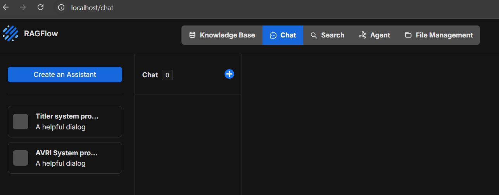
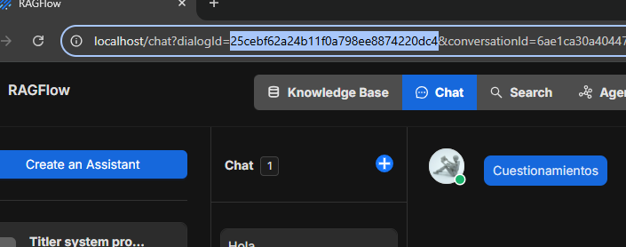
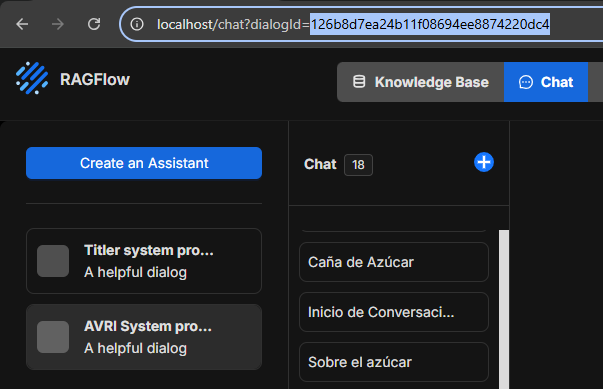
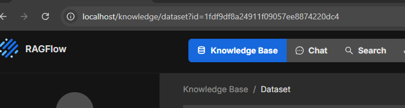

<div align="center">
  <a href="#">
    <picture>
      <source srcset="assets/img/iconbot-dark.png" media="(prefers-color-scheme: dark)">
      <source srcset="assets/img/iconbot-light.png" media="(prefers-color-scheme: light)">
      
    </picture>
  </a>
</div>

# AVRI-Back [](https://coveralls.io/github/MikelBarajas38/AVRI-Back)


## Table of Contents
- [Introduction](#introduction)
- [Prerequisites](#prerequisites)
- [Installation](#installation)
- [RAGFlow Configuration](#ragflow-configuration)
- [Running AVRI](#running-avri)
- [Verification](#verification)
- [RAGFlow Setup](#ragflow-setup)
- [Testing](#testing)
- [Stopping AVRI](#stopping-avri)
- [Additional Notes](#additional-notes)
- [Contribution](#contribution)

---

## Introduction

AVRI-Back is the backend system that powers AVRI (Asistente Virtual del Repositorio Institucional), an AI-powered virtual assistant designed to help users navigate and interact with institutional repositories. The system uses RAGFlow for document processing and retrieval-augmented generation capabilities.

---

## Prerequisites

Before starting, ensure you have the following installed:
- [Git](https://git-scm.com/)
- [Docker](https://www.docker.com/) and Docker Compose
- [RAGFlow](https://ragflow.io/)

### Hardware Requirements

The following minimum hardware specifications are required for optimal performance:

- **RAM**: At least 8GB
- **CPU**: Intel i3 10th generation or equivalent
- **Storage**: Approximately 50GB of free space

---

## Installation

### 1. Clone the Repository

```bash
git clone https://github.com/MikelBarajas38/AVRI-Back.git
```

### 2. Navigate to the Project Directory

```bash
cd AVRI-Back
```

---

## RAGFlow Configuration

> **Important**: RAGFlow must be running before starting AVRI-Back.

### 1. Initialize RAGFlow

Navigate to the folder where RAGFlow is installed and run:

```bash
docker compose -f docker/docker-compose.yml up -d
```

### 2. Check RAGFlow Logs

```bash
docker logs -f ragflow-server
```

### 3. Verify Successful Startup

If everything executed correctly, you should see:
- The RAGFlow logo in ASCII art
- The "TASK EXECUTOR" message


---

## Running AVRI

Once RAGFlow is running, start AVRI-Back with the following command:

```bash
docker compose -f docker-compose.yml -f docker-compose.ragflow.yml up
```

This command will initialize all necessary containers.

---

## Verification

### Successful Startup Logs

If the execution is successful, you should see logs similar to these:


### Service Status

You can verify the container status with:

```bash
docker ps
```

---

## RAGFlow Setup

### Initial Configuration

For chat and embedding functionality, it is recommended to use local models. However, if needed, you can use an API key from your preferred provider. Google's Gemini offers free API keys with a limited token quota at [https://aistudio.google.com/api-keys](https://aistudio.google.com/api-keys).

### Account Creation

If this is your first time using RAGFlow, create an account at:

```
http://localhost/login
```

### Creating Assistants

After creating your account, log in and navigate to the chats view:

```
http://localhost/chat
```

Click the "Create an Assistant" button.



You will need to create two different assistants:
1. One for "Titles"
2. One for "Chats"

#### RAGFLOW_TITLER

Create the first assistant named "Titler system prompt" with the following opening greeting:

```
Respuesta en base a documentos
```

In the **Prompt Engine** section, add the following text in the **System Prompt** field:

```bash
Eres un asistente experto en generar títulos breves y descriptivos para conversaciones.
 
Tu tarea es leer la primera consulta del usuario y generar un título claro, conciso y representativo del tema principal de la conversación.
 
El título debe tener entre 3 y 8 palabras, sonar natural, y poder usarse como nombre para un chat.
 
No incluyas signos de puntuación innecesarios, no respondas con frases completas, ni expliques tu elección. Solo devuelve el título sugerido.
 
Ignora saludos, despedidas o palabras genéricas como “hola”, “quiero”, “ayuda con”, etc.
 
Aquí está una base de conocimientos que puede ayudarte:
 
{knowledge}
 
Aquí termina la base de conocimientos
```

Click "Ok" to save. After creating the assistant, select it and locate the `dialogId` parameter in the URL. Copy this value and add it to your `.env` file as the `RAGFLOW_TITLER_ID` variable.



#### RAGFLOW_ASSISTANT

Create the second assistant named "AVRI System prompt" with the following opening greeting:

```
Hola, ¿Cómo te puedo ayudar?
```

In the **Prompt Engine** section, add the following text in the **System Prompt** field:

```bash
Eres un asistente virtual útil y conocedor del repositorio institucional de una universidad. Tu tarea es interactuar de manera natural con los usuarios y ayudarlos a encontrar los documentos o información más relevantes disponibles en la base de conocimientos.
 
Utiliza el contenido recuperado para recomendar documentos específicos, resumir secciones relevantes o responder directamente con base en los datos del repositorio. Personaliza tus respuestas considerando el perfil del usuario y el historial de conversación, incluyendo su tipo (por ejemplo: alumno, autor o administrador).
 
Si la base de conocimientos no contiene información relevante para responder a la pregunta, debes indicar explícitamente: "La respuesta que buscas no se encuentra en la base de conocimientos."
 
No inventes respuestas ni salgas del contenido recuperado. Prioriza siempre la claridad, la relevancia y las recomendaciones respaldadas por documentos. Recuerda no utilizar estilos en los mensajes, y solo deja la respuesta en texto plano.
 
      Here is the knowledge base:
      {knowledge}
      The above is the knowledge base.
```

Click "Ok" to save. After creating the assistant, select it and locate the `dialogId` parameter in the URL. Copy this value and add it to your `.env` file as the `RAGFLOW_ASSISTANT_ID` variable.



#### DATASET_ID

Create a new knowledge database from the knowledge section by clicking "Create knowledge base":

```
http://localhost/knowledge
```

Select the knowledge base and locate the `dataset?id` parameter in the URL. Copy this ID and add it to your `.env` file as the `DATASET_ID` variable.




#### RAGFLOW_API_KEY

To obtain the RAGFlow API Key, navigate to the API section in user settings:

```
http://localhost/user-setting/api
```

Click the "API KEY" button, then "Create new Key" (if needed). Copy the generated key and add it to your `.env` file as the `RAGFLOW_API_KEY` variable.

#### Other Environment Variables

Add the following variables to your `.env` file:

- `RI_BASE_URL=https://repositorioinstitucional.uaslp.mx/`
- `RI_BASE_URL_REST=https://repositorioinstitucional.uaslp.mx/rest`
- `RAGFLOW_BASE_URL=http://ragflow-server:9380/api/v1`

### Complete .env Example

Your `.env` file should look similar to this:

```bash
GEMINI_API_KEY=Bd...ff
RAGFLOW_API_KEY=ragflow-df...gj
RAGFLOW_BASE_URL=http://ragflow-server:9380/api/v1
RAGFLOW_ASSISTANT_ID=sd...6f
RAGFLOW_TITLER_ID=54...sd
DATASET_ID=sf...fd
RI_BASE_URL=https://repositorioinstitucional.uaslp.mx/
RI_BASE_URL_REST=https://repositorioinstitucional.uaslp.mx/rest
```

---

## Testing

The test suite covers (but is not limited to) the following components:
- Management Commands
- API Endpoints
- Core Models & Data
- Authentication & User Management

### Running Tests

To run the tests and view the coverage report:

```bash
docker compose run --rm app sh -c "coverage run --source='.' manage.py test && coverage report"
```

---

## Stopping AVRI

### Method 1: Manual Interruption

1. Press `Ctrl + C` in the terminal where the containers are running
2. Execute the following command to ensure all services stop:

```bash
docker compose down
```

### Method 2: Direct Command

```bash
docker compose down
```

---

## Additional Notes

- Ensure Docker is running before starting any service
- All required ports must be available on your system
- For more information about RAGFlow, consult the [official documentation](https://ragflow.io/docs)

---

## Dependency Versions

```
Python 3.12.10
pip 25.2 
absl-py==2.1.0
accelerate==1.1.1
altair==5.4.1
altgraph==0.17.4
annotated-types==0.7.0
anyio==4.4.0
asgiref==3.8.1
asttokens==2.4.1
astunparse==1.6.3
attrs==24.2.0
base==0.0.0
bcrypt==4.3.0
beautifulsoup4==4.12.3
bigquery==0.0.41
bleach==6.2.0
blinker==1.8.2
cachetools==5.3.3
certifi==2024.2.2
cffi==1.16.0
charset-normalizer==3.3.2
click==8.1.7
cloudpickle==3.1.1
colorama==0.4.6
comm==0.2.2
comtypes==1.4.8
contourpy==1.2.1
cryptography==42.0.5
CTkColorPicker==0.9.0
customtkinter==5.2.2
cycler==0.12.1
dacktool==0.0.7
darkdetect==0.8.0
dbstream==0.1.25
debugpy==1.8.1
decorator==5.1.1
defusedxml==0.7.1
Django==5.2
django-cors-headers==4.7.0
djangorestframework==3.16.0
dm-tree==0.1.8
docutils==0.21.2
drf-spectacular==0.28.0
einops==0.8.0
etils==1.8.0
executing==2.0.1
Farama-Notifications==0.0.4
fastapi==0.115.4
fastjsonschema==2.20.0
filelock==3.14.0
Flask==3.0.3
flatbuffers==24.3.25
fonttools==4.51.0
frozendict==2.4.4
fsspec==2024.3.1
future==1.0.0
gast==0.5.4
gitdb==4.0.11
GitPython==3.1.43
google==3.0.0
google-api-core==2.18.0
google-api-python-client==1.7.11
google-auth==2.29.0
google-auth-httplib2==0.0.3
google-auth-oauthlib==1.2.0
google-cloud==0.34.0
google-cloud-bigquery==3.21.0
google-cloud-bigquery-storage==2.24.0
google-cloud-core==2.4.1
google-cloud-secret-manager==2.7.2
google-cloud-storage==2.16.0
google-cloud-translate==3.15.3
google-cloud-vision==3.7.2
google-crc32c==1.5.0
google-pasta==0.2.0
google-resumable-media==2.7.0
googleapis-common-protos==1.63.0
googleauthentication==0.0.17
grpc-google-iam-v1==0.12.7
grpcio==1.62.2
grpcio-status==1.62.2
gym==0.26.2
gym-notices==0.0.8
gymnasium==1.1.1
h11==0.14.0
h5py==3.11.0
html5lib==1.1
httpcore==1.0.5
httplib2==0.22.0
httpx==0.27.0
huggingface-hub==0.26.2
idna==3.7
importlib_resources==6.4.0
inflection==0.5.1
iniconfig==2.1.0
intel-openmp==2021.4.0
ipykernel==6.29.4
ipython==8.23.0
itsdangerous==2.2.0
jedi==0.19.1
Jinja2==3.1.4
joblib==1.4.0
jsonpatch==1.33
jsonpointer==3.0.0
jsonschema==4.23.0
jsonschema-specifications==2024.10.1
jupyter_client==8.6.1
jupyter_core==5.7.2
jupyterlab_pygments==0.3.0
keras==3.2.1
keyboard==0.13.5
kiwisolver==1.4.5
langchain-core==0.2.26
langchain-ollama==0.1.1
langsmith==0.1.95
libclang==18.1.1
libcst==1.3.1
lxml==5.2.2
Markdown==3.6
markdown-it-py==3.0.0
MarkupSafe==2.1.5
matplotlib==3.8.4
matplotlib-inline==0.1.7
mdurl==0.1.2
mime==0.1.0
mistune==3.0.2
mkl==2021.4.0
ml-dtypes==0.3.2
mpmath==1.3.0
multitasking==0.0.11
namex==0.0.8
narwhals==1.13.1
nbclient==0.10.0
nbconvert==7.16.4
nbformat==5.10.4
nest-asyncio==1.6.0
networkx==3.3
nltk==3.9.1
numpy==1.26.4
oauthlib==3.2.2
ollama==0.3.1
opencv-python==4.9.0.80
opt-einsum==3.3.0
optree==0.11.0
orjson==3.10.6
packaging==24.0
pandas==2.2.3
pandocfilters==1.5.1
paramiko==3.5.1
parso==0.8.4
peewee==3.17.5
pefile==2023.2.7
perl==1.0.0
Pillow==9.5.0
platformdirs==4.2.0
pluggy==1.6.0
prettytable==3.16.0
promise==2.3
prompt-toolkit==3.0.43
proto-plus==1.23.0
protobuf==4.25.3
psutil==5.9.8
psycopg==3.2.10
psycopg2==2.9.10
pure-eval==0.2.2
py-cpuinfo==9.0.0
pyarrow==16.0.0
pyasn1==0.6.0
pyasn1_modules==0.4.0
pycparser==2.22
pydantic==2.8.2
pydantic_core==2.20.1
pydeck==0.9.1
pygame==2.6.0
Pygments==2.17.2
pyinstaller==6.9.0
pyinstaller-hooks-contrib==2024.7
PyNaCl==1.5.0
pyparsing==3.1.2
pypiwin32==223
PyQt5==5.15.10
PyQt5-Qt5==5.15.2
PyQt5-sip==12.13.0
pytest==8.4.0
python-dateutil==2.9.0.post0
pyttsx3==2.98
pytz==2024.1
pywin32==306
pywin32-ctypes==0.2.2
PyYAML==6.0.1
pyzmq==26.0.2
referencing==0.35.1
regex==2024.11.6
requests==2.31.0
requests-oauthlib==2.0.0
rich==13.7.1
rpds-py==0.20.1
rsa==4.9
safetensors==0.4.5
scikit-learn==1.4.2
scipy==1.13.0
seaborn==0.13.2
setuptools==69.5.1
Shimmy==2.0.0
sip==6.8.3
six==1.16.0
smmap==5.0.1
sniffio==1.3.1
soupsieve==2.5
sqlparse==0.5.3
stable_baselines3==2.6.0
stack-data==0.6.3
starlette==0.41.2
streamlit==1.39.0
sympy==1.13.1
tbb==2021.12.0
tenacity==8.5.0
tensorboard==2.16.2
tensorboard-data-server==0.7.2
tensorflow==2.16.1
tensorflow-datasets==4.9.4
tensorflow-intel==2.16.1
tensorflow-metadata==1.15.0
termcolor==2.4.0
thop==0.1.1.post2209072238
threadpoolctl==3.4.0
tinycss2==1.4.0
tkinterdnd2==0.3.0
tokenizers==0.20.3
toml==0.10.2
torch==2.5.1
tornado==6.4
tqdm==4.66.2
traitlets==5.14.3
transformers==4.46.3
typing_extensions==4.11.0
tzdata==2024.2
ultralytics==8.2.38
ultralytics-thop==2.0.0
uritemplate==3.0.1
urllib3==2.2.1
utils==1.0.2
utils-core==0.1.2
uvicorn==0.32.0
watchdog==5.0.3
wcwidth==0.2.13
webencodings==0.5.1
Werkzeug==3.0.2
wheel==0.43.0
wrapt==1.16.0
yfinance==0.2.40
zipp==3.18.1

```

---

## Contribution

If you encounter any problems or have suggestions for improvements:

1. Open an [issue](https://github.com/MikelBarajas38/AVRI-Back/issues)
2. Submit a pull request with your proposed changes

For more details on contributing, please review our [contribution guidelines](CONTRIBUTING.md).

---
